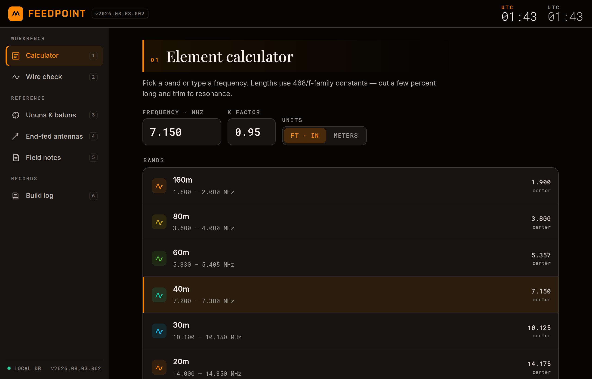
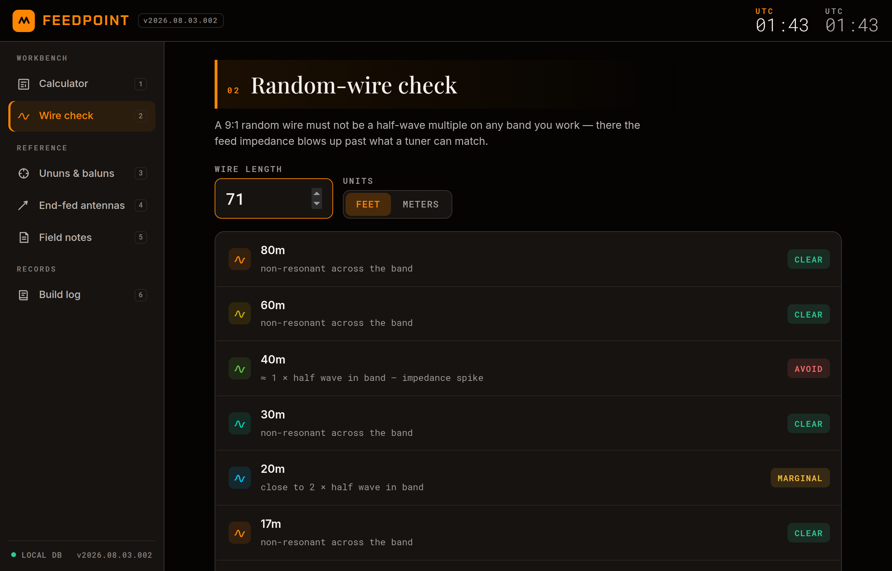
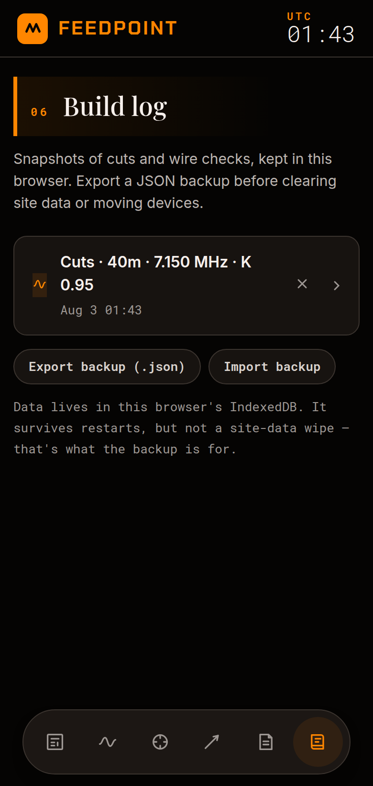

<div align="center">


# FEEDPOINT

**The wire-antenna workbench that lives in a single file.**

Cut charts, resonance verdicts, transformer recipes, and a build log for the
ham bands, 160–6 m — fully offline, zero dependencies, one `.html` file you
can keep forever.

<br>

<a href="https://cdburgess75.github.io/FeedPoint/"></a>

*…or download [`feedpoint.html`](feedpoint.html) and double-click it.
That is the entire install.*

<br>

[](https://github.com/cdburgess75/FeedPoint/actions/workflows/ci.yml)
[](https://github.com/cdburgess75/FeedPoint/actions/workflows/pages.yml)


<br>



</div>

---

## Why this exists

Every antenna cut chart on the internet assumes you have the internet. On a
summit, at a field day table, or in a basement shack with the router off,
FEEDPOINT still works — because it isn't a website, it's a **file**. The
fonts, the icons, the formulas, the storage, all of it travels inside one
HTML document. Copy it to a thumb drive, email it to a friend, open it in
2040. It will still cut wire.

- **No build step. No CDN. No account. No tracking.** View source and you can
  read the whole application.
- **Your data stays yours** — settings and the build log live in your
  browser's IndexedDB, and export to a plain JSON file you control.
- **Honest math** — verdicts computed across entire band spans, thresholds
  documented, no hand-waving. When the formula disagrees with folklore, the
  formula wins.

## The tour

Six views, reachable by click or by pressing <kbd>1</kbd>–<kbd>6</kbd>:

| # | View | What it does |
|:-:|------|--------------|
| 01 | **Element calculator** | Pick a band or type a frequency; get EFHW, dipole, ¼-wave vertical, counterpoise, full-wave loop, and ⅝-wave cut lengths — feet-and-inches to the quarter inch, or meters. Adjustable K factor. |
| 02 | **Random-wire check** | Test a 9:1 random-wire length against every band, 80–10 m. Verdicts across the whole band span, plus the nearest spike-free length when yours fails. |
| 03 | **Ununs & baluns** | Build recipes for the four boxes that cover nearly every wire antenna: 1:1 choke, 4:1, 9:1, and the 49:1 EFHW autotransformer (2:14 turns) — with QRP/100 W winding tables and a toroid core cheat sheet. |
| 04 | **End-fed antennas** | EFHW vs EFRW: harmonics tables, counterpoise rules, feed-end placement, and why 15 m rides the third harmonic. |
| 05 | **Field notes** | The stuff datasheets skip: FT8 duty-cycle derating, NVIS as a feature, why a warm core is burning your signal. |
| 06 | **Build log** | Every saved cut and wire check, as expandable spec sheets with delete-and-undo. Exports and imports JSON backups. |

## The verdict engine doesn't flatter you



A random wire near a half-wave multiple presents an impedance spike no tuner
can match. Most charts check band centers; FEEDPOINT checks the **entire band
span** — because a wire that's clear at 7.150 can still spike at 7.000. That's
why the classic 71-footer honestly flags AVOID on 40 m above, and why the app
offers the nearest **spike-free** length instead of pretending. (Fun fact the
math forced us to document: past ~13 ft, *no* length avoids even MARGINAL on
all nine bands. Antennas are compromises. FEEDPOINT just refuses to lie about
which one you're making.)

## Made for the field



- **Phone-first when it needs to be** — the sidebar becomes a floating dock,
  touch targets stay 48 px+, and the layout works one-handed on a summit.
- **Dual clocks** — UTC for the log, local for lunch, automatically labeled
  with your timezone.
- **Keyboard-driven when you're home** — number keys switch views; every
  control is focusable and screen-reader labeled (`aria-live` toasts, visible
  focus rings, reduced-motion respected).
- **Storage honesty** — a status dot tells you whether IndexedDB is really
  persisting. If it isn't (some sandboxed previews), saves say *"Session
  only"* instead of a comforting lie, and the log still works for the session.

<br clear="right">

## Your data is a file too

Backups are human-readable JSON — versioned, portable, and accepted back
case-insensitively (including backups from the app's earlier life as
`halfwave`):

```json
{
  "app": "feedpoint",
  "version": 1,
  "build": "v2026.08.03.002",
  "exported": "2026-08-03T01:41:00.000Z",
  "settings": { "metric": false, "freq": "7.150", "kf": "0.95" },
  "log": [ { "ts": 1786064460000, "kind": "cut", "title": "Cuts · 40m · 7.150 MHz · K 0.95", "items": [] } ]
}
```

## Under the hood

**The formulas** (f in MHz, feet out, all scaled by K/0.95):

| Element | Formula | | Element | Formula |
|---------|:-------:|-|---------|:-------:|
| Half wave | `468 / f` | | Full-wave loop | `1005 / f` |
| Quarter wave | `234 / f` | | ⅝ wave | `585 / f` |
| Counterpoise 0.05 λ | `0.05 × 984 / f` | | Verdict thresholds | ±7% AVOID · ±15% MARGINAL |

**The look** is Macro Dark — warm near-black, orange accent, hairline edges,
embedded Inter / Roboto Mono / Playfair Display / Chakra Petch (latin
subsets, ~150 KB of the file is fonts):


`#FF8600` · `#CFAD00` · `#62CA40` · `#00D4B0` · `#00C7FF` · `#171310` · `#050403`

**Storage** is raw IndexedDB — one database, one key-value store, every
access wrapped so the app degrades gracefully anywhere it runs.

## Development

There is no build. Edit `feedpoint.html`, refresh, done. The functional suite
(35 checks: navigation, formatting, verdicts, import validation, escaping,
undo, persistence, responsive breakpoints) runs headless and gates every PR
through GitHub Actions:

```sh
npm install playwright
npx playwright install chromium
node tests/app.test.mjs
```

Project history, conventions, and design contract live in
[`HANDOFF.md`](HANDOFF.md).

## Roadmap

- Load a saved cut back into the calculator, printable cut sheets, per-entry notes
- K-factor presets (bare wire / insulated / inverted-V)
- ITU region band plans
- PWA manifest — install it on the phone that goes up the mountain

---

<div align="center">

**73** — now go cut some wire. 📻

</div>
